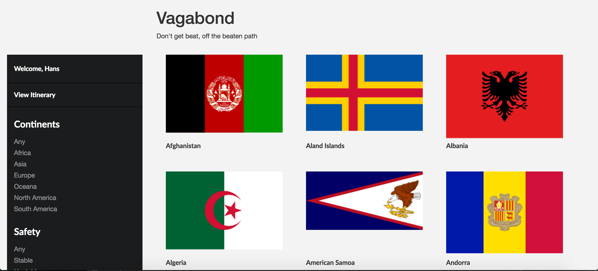
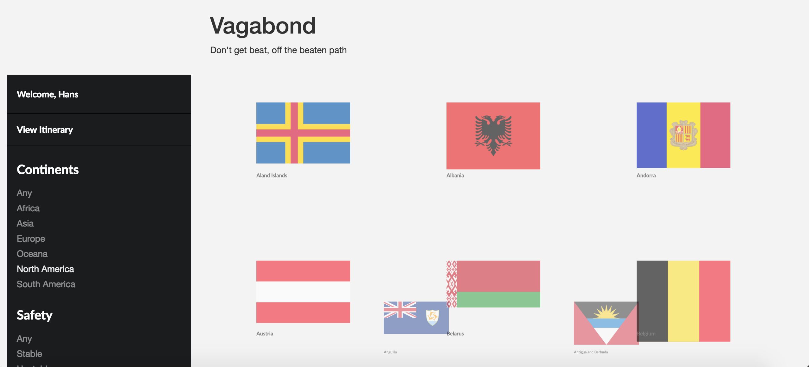
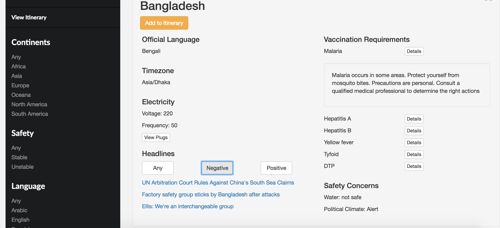
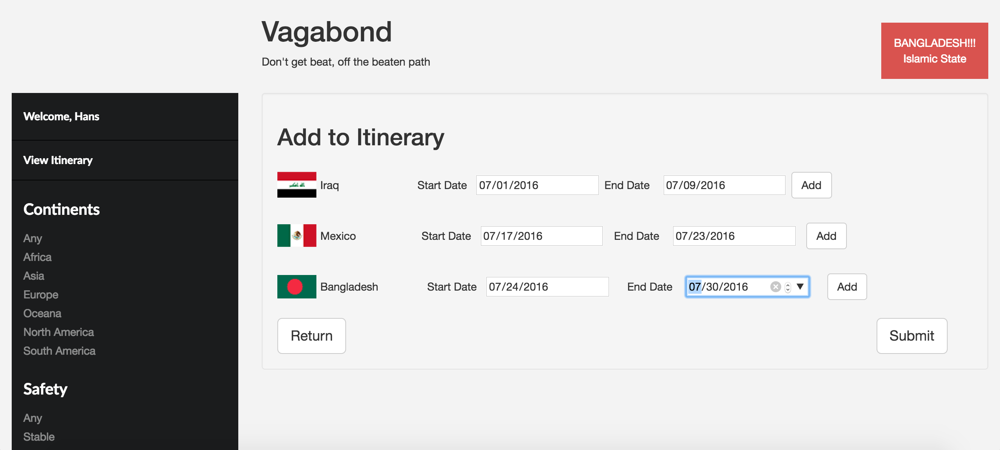
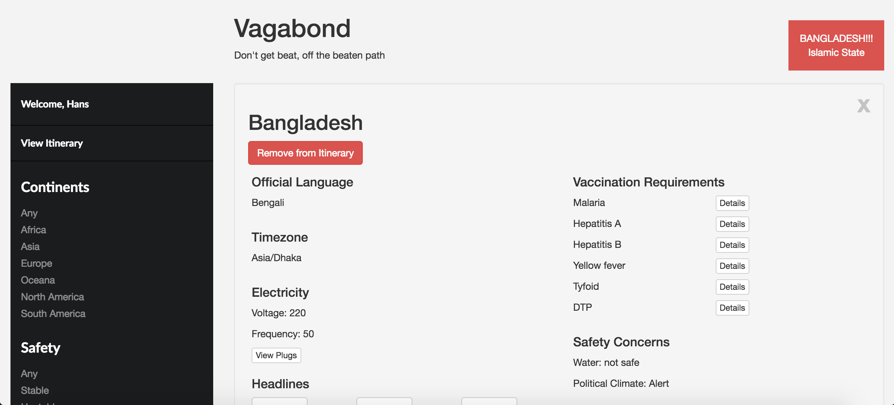

# Vagabond #

[View on Heroku]

Vagabond is a planner that helps international travelers create itineraries based on safety and logistics.
#### How it works: ####
* View flags from 192 different countries
* Filter countries by continent, safety level, and language
* Browse details about each country, including:
  * Official Language
  * Timezone
  * Required Vaccinations
  * Safety Concerns
  * News Headlines
* Create an itinerary
* Receive alerts about a country's safety

## View Countries ##

## Filter Countries  ##

## View Pertinent Travel Information ##

## Create an Itinerary ##

## Receive Alerts ##

## Technology Used: ##
* HTML5
* CSS
* Bootstrap
* Javascript
* Node.js
* Express
* Isotope.js

[View on Heroku]: <https://armatis-vagabond.herokuapp.com/>
